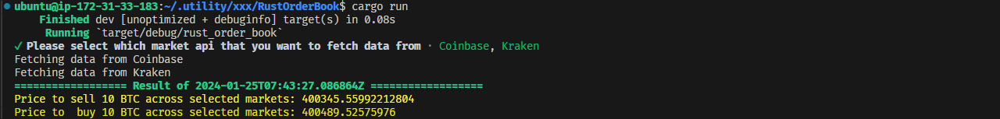

<h3 style="color:yellow;">Project Overview:</h3>

Project _Rust Order Book Fetching_ is a robust Rust terminal program that fetches and processes order books data from CoinBase Pro and Gemini Exchanges, providing a succinct summary of the price to buy or sell 10 bitcoins.

I've configured the data structure to fit this context:

- **Bids**: The line of buyers as referenced in the article.
  - Array of records. Each record contains quantity and price. Sorted by highest price first.
- **Offers**: The line of sellers as referenced in the article.
  - Array of records. Each record contains quantity and price. Sorted by lowest price first.
- **Order Book**: This is an object that contains the bids and offers data arrays.

The exchanges all have JSON REST APIs for fetching order books.

1. **CoinBase Pro**:
   - Docs: <https://docs.pro.coinbase.com/#get-product-order-book>
   - Endpoint for BTC-USD: <https://api.pro.coinbase.com/products/BTC-USD/book?level=2>
2. **Gemini Exchange**:
   - Docs: <https://docs.gemini.com/rest-api/#current-order-book>
   - Endpoint for BTC-USD: <https://api.gemini.com/v1/book/BTCUSD>
3. **Kraken Exchange(Bonus)**:
   - Docs: <https://www.kraken.com/en-us/features/api#get-order-book>
   - Endpoint for BTC-USD: <https://api.kraken.com/0/public/Depth?pair=XBTUSD>

<h3 style="color:yellow">For successful execution of our program, rust should be installed beforehand. Use the command provided below for installation:</h3>

```bash
curl --proto '=https' --tlsv1.2 -sSf https://sh.rustup.rs | sh
```

After successful installation of Rust, following message will appear:

```
Rust is installed now. Great!
```

<h3 style="color:yellow;">Execution Of Program:</h3>
Once Rust is installed, let's execute our program using cargo:

```bash
git clone https://<your_git_token_here>@github.com/lakefishingman522/RustOrderBook.git
cd RustOrderBook
cargo run
```

This will open a selection console. Select at least one market to fetch data from.


After making selections and processing the data, results will be as displayed below:


## Great!

## Future Improvements:

While this project is operational, I was restricted by time constraints during its development. There are several areas for potential improvements:

- **Real-time Data Analysis:** Currently, the project operates using data fetched from APIs—and it's static. By integrating WebSockets, we could display real-time data and provide a more accurate dynamic analysis.
- **Market Strategy Algorithms:** With the availability of real-time data, we could build and integrate market strategy algorithms, enabling users to create and backtest their strategies and directly execute their trades.
- **Expanded Data Sources:** We could add more exchanges to have a more diverse and precise overview of the market.
- **Performance Improvements:** Improvements could be made in efficiency and speed, particularly in handling and processing data at scale.
- **Comprehensive Error Handling:** While the application handles basic errors, comprehensive error handling could add more reliability and robustness to the program.

I hope to explore these improvements in the future and welcome any contributions. Contributions could range from feature enhancement, performance improvements to bug fixes—everything is of value.
